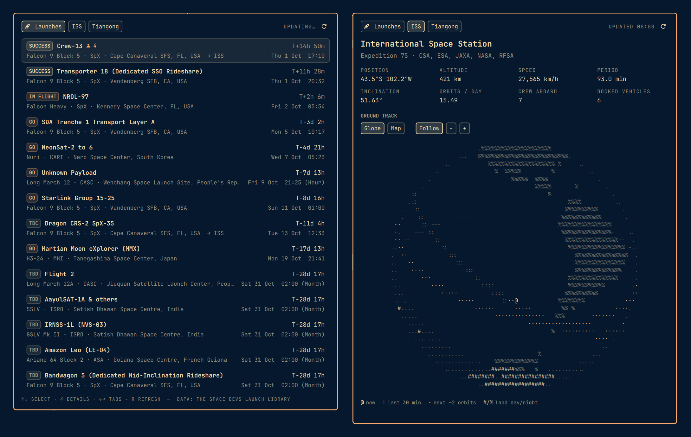

# Launch Schedule

An Omarchy bar widget for following space launches. A rocket in the bar counts
down to the next launch; click it for the upcoming schedule, live webcast
links, crew, and a text-mode globe showing each mission's predicted ground
track against its destination.



## Features

**In the bar**

- Just a rocket when nothing launches in the next two days.
- `󱓞 T-2h 14m` once a launch is within two days (the window is configurable).
- The rocket animates while a launch is happening: a webcast is live, a vehicle
  is in flight, or it is within 15 minutes either side of liftoff.
- Uses the bar's own foreground colour, so it matches every theme and the
  transparent bar.

**Launches tab**

- The next 14 launches with status (GO, TBD, TBC, In Flight, Success), provider,
  rocket, pad, local launch time and countdown.
- Finished launches stay for a few hours after liftoff (3 by default) and
  while their webcast is live or the vehicle is in flight, so you can follow
  one right after it launches; after that only upcoming launches remain.
- Badges for live webcasts, crew count, and missions bound for the ISS or
  Tiangong.

**Launch details**

- Every published webcast (NASA, SpaceX, Spaceflight Now, agency streams…),
  with live ones marked. Click to open in your browser.
- A link to the Flight Club ascent simulation where one exists.
- Trajectory globe: pad, ascent, resulting orbit, the vehicle's modelled
  position, and the destination station with its own orbit. Drag to spin,
  scroll to zoom, switch between globe and flat map, and scrub or play the
  flight clock.
- Launch azimuth, inclination, orbital period, and modelled distance to the
  station.
- Mission details, crew with roles and agencies, who is already aboard the
  destination station, and the countdown timeline.

**ISS and Tiangong tabs**

- Live position, altitude, speed, period, inclination, past and upcoming
  ground track.
- Current expedition crew, docked vehicles, and upcoming flights to the
  station.

### About the trajectories

Station positions come from current CelesTrak orbital elements and match live
trackers closely. Launch tracks are an estimate: a circular orbit at the
mission's target inclination, an eased ascent, and no phasing burns. They show
where a rocket is heading, not real flight data, and the panel labels them as
modelled.

## Install

```bash
omarchy plugin add https://github.com/deandesign/omalaunchschedule.git --enable --yes
```

The widget lands in the right-hand section of the bar. Move it with:

```bash
omarchy bar move io.github.deandesign.launch-schedule --section center
```

Or by hand:

```bash
git clone https://github.com/deandesign/omalaunchschedule.git \
  ~/.config/omarchy/plugins/io.github.deandesign.launch-schedule
omarchy-shell shell rescanPlugins
omarchy plugin enable io.github.deandesign.launch-schedule
```

### Update

```bash
omarchy plugin update io.github.deandesign.launch-schedule
```

## Removal

```bash
omarchy plugin remove io.github.deandesign.launch-schedule
rm -rf ~/.cache/omarchy-launch-schedule
```

Or by hand:

```bash
omarchy plugin disable io.github.deandesign.launch-schedule
rm -rf ~/.config/omarchy/plugins/io.github.deandesign.launch-schedule
rm -rf ~/.cache/omarchy-launch-schedule
omarchy-shell shell rescanPlugins
```

Disabling removes the widget's entry from `~/.config/omarchy/shell.json`. The
only other thing the plugin writes is its download cache in
`~/.cache/omarchy-launch-schedule/`.

## Usage

| Input | Action |
|---|---|
| Left click | Open or close the panel |
| Middle click | Refresh now |
| `↑` `↓` / `j` `k` | Select a launch (list) or scroll (details) |
| `Enter` | Open launch details |
| `Esc` / `Backspace` | Back, then close |
| `1` `2` `3` / `←` `→` | Launches, ISS, Tiangong tabs (list) |
| `←` `→` / `h` `l` | Spin the globe (details and station tabs) |
| `w` `s` | Tilt the globe |
| `+` `-` | Zoom |
| `m` | Globe or flat map |
| `[` `]` / `{` `}` | Step the flight clock 1 or 10 minutes |
| `Space` | Play or pause the flight clock |
| `0` / `n` | Jump to T-0 / now |
| `o` | Open the first webcast |
| `f` | Follow the station again |
| `r` | Refresh |

The panel can also be driven over IPC:

```bash
omarchy-shell io.github.deandesign.launch-schedule toggle
omarchy-shell io.github.deandesign.launch-schedule refresh
```

## Settings

Set inline on the widget's entry in `~/.config/omarchy/shell.json`:

| Key | Default | Meaning |
|---|---|---|
| `showCountdown` | `true` | Show the countdown next to the rocket |
| `countdownHours` | `48` | Only show it when the next launch is this close |
| `recentHours` | `3` | Hours a finished launch stays in the list (live or in-flight launches always stay; `0` hides the rest at once) |
| `icon` | `󱓞` | Bar glyph (any Nerd Font icon) |

```json
{ "id": "io.github.deandesign.launch-schedule", "countdownHours": 24 }
```

## Requirements and dependencies

- Omarchy 4 (Quattro) or newer, with a Nerd Font (Omarchy's default font is one).
- `bash`, `curl` and `jq`, all installed by Omarchy.
- `xdg-open` to open webcast links in your browser.
- Network access to these public APIs. No account or API key is needed, and
  nothing about you is sent beyond ordinary HTTP requests:
  - [The Space Devs Launch Library 2](https://thedevs.network/) at
    `ll.thespacedevs.com`: launches, webcasts, crew, stations.
  - [CelesTrak](https://celestrak.org/) at `celestrak.org`: orbital elements
    for the ISS and Tiangong.

No sudo or pkexec is required, and the plugin installs nothing outside its own
folder and cache.

Launch Library's free tier allows about 15 requests an hour, so responses are
cached on disk: launches refresh every 30 minutes, crew and orbital data every
6 hours, and a manual refresh never refetches anything newer than five minutes.
If a fetch fails, the last good copy is shown.

## Files

| File | Purpose |
|---|---|
| `manifest.json` | Plugin manifest |
| `BarWidget.qml` | Bar icon, countdown and lift-off animation |
| `Panel.qml` | The popup: lists, details, station views, keyboard handling |
| `Globe.qml` | Text-mode globe and map component |
| `Model.js` | API parsing, orbit propagation and globe rendering |
| `Land.js` | 2° land mask rasterized from Natural Earth |
| `bin/fetch` | Cached downloads from Launch Library and CelesTrak |

## Credits

- Launch data: [The Space Devs](https://thespacedevs.com/) Launch Library 2.
- Orbital elements: [CelesTrak](https://celestrak.org/).
- Coastlines: [Natural Earth](https://www.naturalearthdata.com/) 1:110m land
  (public domain).

This project is not affiliated with The Space Devs, CelesTrak, NASA or any
launch provider.

## License

[MIT](LICENSE)
